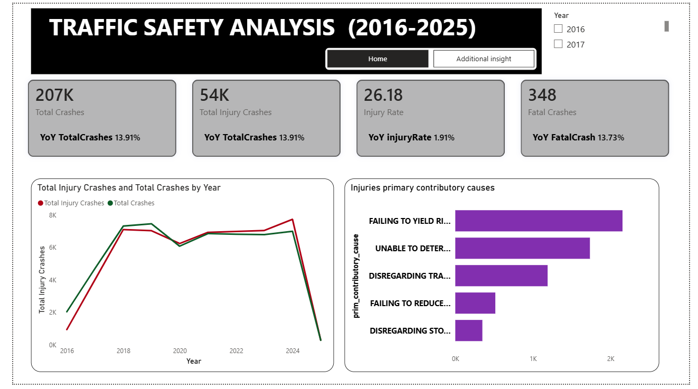
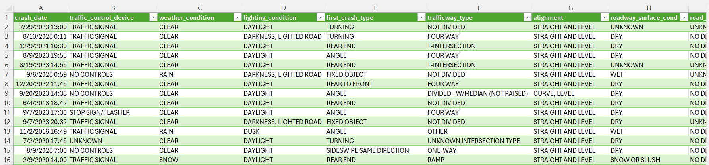

# Traffic-Safety-Analysis (2016-2025)
## A 10-year analysis of traffic accident data using Power BI to identify causes, trends, and prevention strategies.

## Executive Summary
- Traffic authorities lacked a clear understanding of crash patterns across the city over the past decade.
- An interactive Power BI dashboard was developed using over 200,000 records to track key accident KPIs, causes, timing, and severity.
- The report provides data-driven insights to support leadership decision-making.
- Findings show that “Unable to Determine” is the leading contributory cause, with the highest number of crashes recorded in 2024.
## Problem Statement
City leadership requires data-driven insights into accident trends from 2016–2025 to guide policy decisions and justify budget allocation
### Key Questions
- How have crash rates changed over time?
- What are the main causes of crashes?
- When and where do crashes occur most frequently?
## The Process (Methodology)
Tools Used: Power BI, Power Query, DAX
## Data Sourcing & Overview
The dataset contains over 200,000 traffic crash records with 24 columns covering accidents between 2016 and 2025.
## Data Cleaning & Transformation
- Removed duplicate and null records
- Created crash time and month columns
- Built a structured date table for analysis

## Analysis & Insights
### Crash Trends
- Over 200,000 crashes recorded overall
- Year-on-year increase of 13.91%
- Sharp decline in 2020, followed by stable rates in 2021–2022
## Injury Crashes
- About 54,000 crashes involved injuries
- Injury crashes increased by 16.08% between 2024 and 2025
## Primary Causes
- “Unable to Determine” accounts for over 58,000 crashes
- “Failing to Yield Right-of-Way” follows with about 43,000 crashes
## Time Analysis
- Most crashes occurred between 3pm and 5pm
- Peak time was 5pm with over 15,000 crashes
## Recommendations
- Install speed and red-light cameras in high-risk areas
- Target enforcement toward major crash causes
- Introduce speed-calming infrastructure
- Use real-time traffic monitoring systems
- Improve emergency response times
- Track repeat offenders digitally
## Links
[power-bi link](https://app.powerbi.com/view?r=eyJrIjoiMDQ2ZjQ3YzUtMzZhOC00MjkxLTk3OGYtOWI2MmRjYTk1MWJmIiwidCI6Ijg0MGMzOTU4LWM4NzMtNDQ4NS1iNTQ1LWQ0ZTRmMTcwODU2NyJ9)

